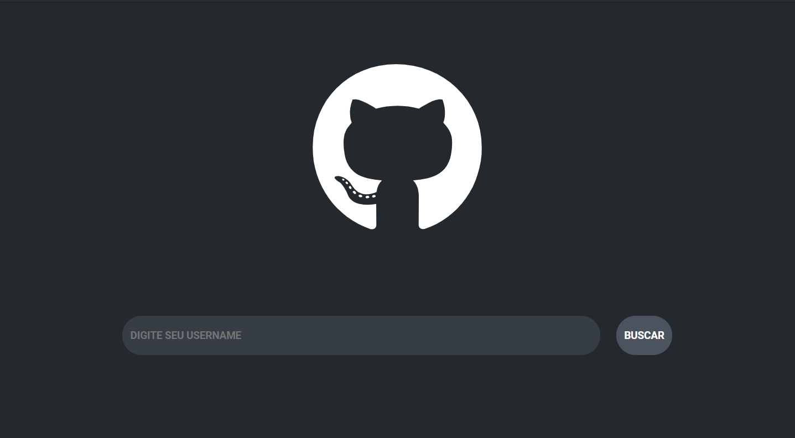
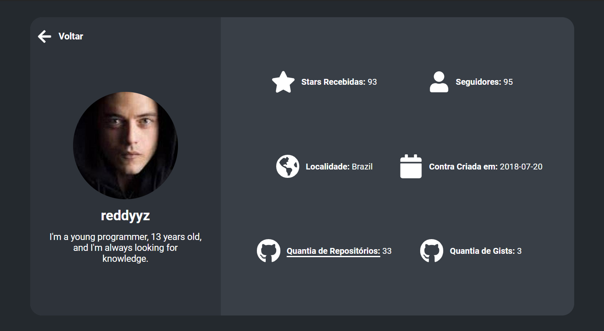
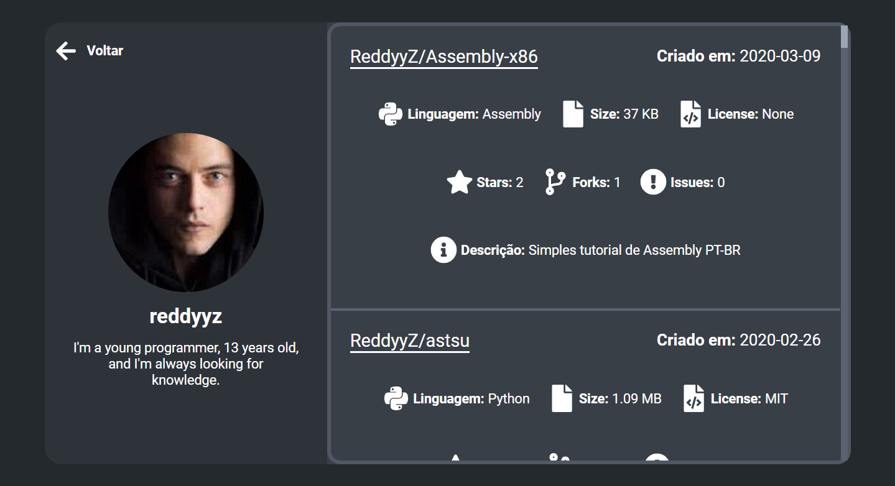

<h1 align="center">Github Stats</h1>

<p align="center">
    <a href="https://githubstatss.herokuapp.com"></a>
    <a href="https://discord.gg/v5d3PZ9"></a>
    
    
    
    <a href="https://insomnia.rest/run/?label=GithubStats&uri=https://raw.githubusercontent.com/JS-RProjects/GithubStats/master/Insomnia_2020-07-01.json" target="_blank"></a>
</p>

## :bar_chart: Projeto
Aplicação desenvolvida em **Node.js** e **ReactJS** usando a API do Github para conseguir informações sobre usuários e repositórios.

**[Backend](https://github.com/JS-RProjects/GithubStats-Backend/tree/master)**                                                                   
**[Frontend](https://github.com/JS-RProjects/GithubStats-Frontend/tree/master)**

---

## :rocket: Tecnologias usadas
- [Node.js](https://nodejs.org/en/)
- [ReactJS](https://reactjs.org/)

**Bibliotecas principais**:

- Express
- Axios

**Bibliotecas de Estilos**:
- sweetalert
- react-icons

---

## :file_folder: Telas





---

## :computer: Rodando o Backend
```bash
# Clone o repositório
$ git clone https://github.com/JS-RProjects/GithubStats-Backend/tree/master

# Acesse a pasta
$ cd GithubStats-Backend

# Instale as dependencias
$ yarn add ou npm install

# Inicie a aplicação
$ yarn dev ou npm dev

# O servidor escutará no endereço: http://localhost:3333
```

## :computer: Rodando o Frontend
```bash
# Clone o repositório
$ git clone https://github.com/JS-RProjects/GithubStats-Frontend/tree/master

# Acesse a pasta
$ cd GithubStats-Frontend

# Instale as dependencias
$ yarn add ou npm install

# Inicie a aplicação
$ yarn start ou npm start

# O servidor escutará no endereço: http://localhost:3000
```

---

## :page_with_curl: License
Projeto está sob a licensa [MIT](LICENSE).

---

<h2 align="center">&lt;/&gt; by <a href="https://github.com/ReddyyZ">ReddyyZ</a></h2>
